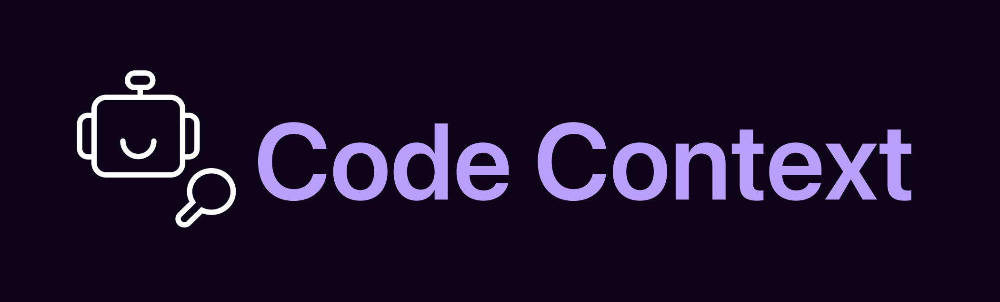
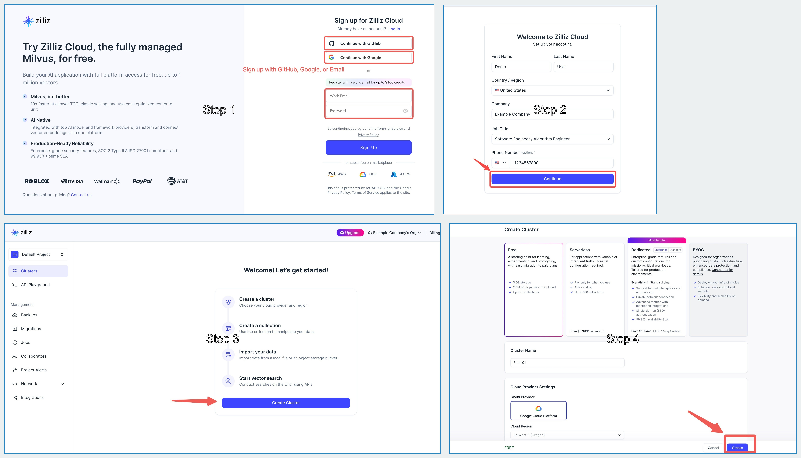
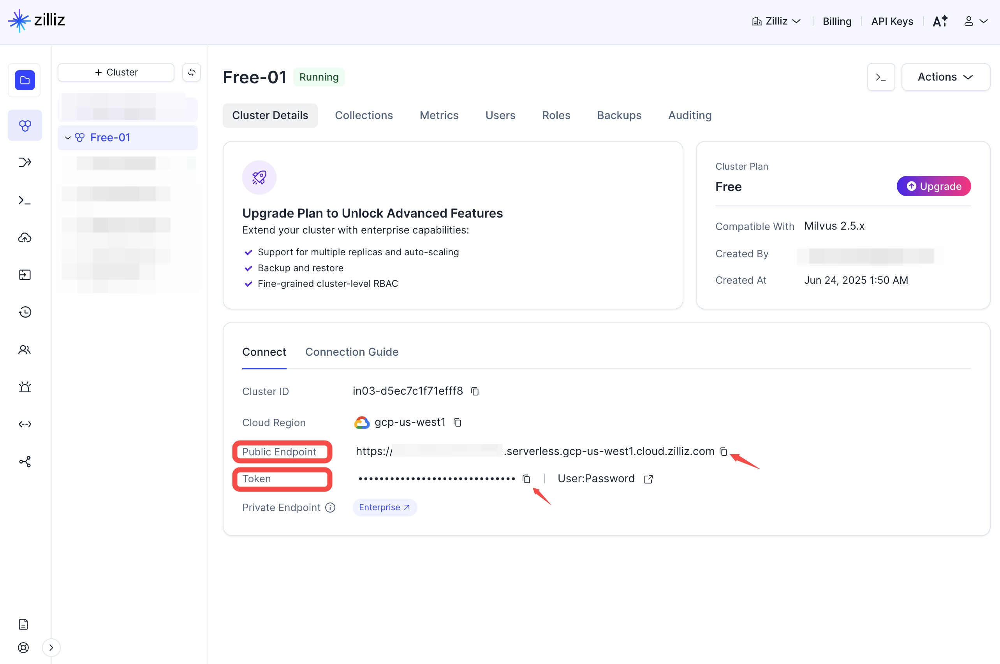

<p align="center">
  <a href="https://github.com/zilliztech/code-context">
    
  </a>
  <h3 align="center"> Add Semantic Search to Claude Code</h2>
</p>

<div align="center">

[](https://opensource.org/licenses/MIT)
[](https://nodejs.org/)
[](https://marketplace.visualstudio.com/items?itemName=zilliz.semanticcodesearch)
[](https://www.npmjs.com/package/@zilliz/code-context-core)
[](https://www.npmjs.com/package/@zilliz/code-context-mcp)
[](https://twitter.com/zilliz_universe)
[](https://deepwiki.com/zilliztech/code-context)
<a href="https://discord.gg/mKc3R95yE5"></a>
</div>

**Code Context** is an MCP plugin that adds semantic code search to Claude Code and other AI coding agents, giving them deep context from your entire codebase.

---

## ✨ Features

- 🔍 **Semantic Code Search**: Ask questions like *"find functions that handle user authentication"* and get relevant, context-rich code instantly.
- 🧠 **Context-Aware**: Discover large codebase, understand how different parts of your codebase relate, even across millions of lines of code.
- ⚡ **Incremental Indexing**: Efficiently re-index only changed files using Merkle trees.
- 🧩 **Intelligent Code Chunking**: Analyze code in Abstract Syntax Trees (AST) for chunking.
- 🗄️ **Scalable**: Integrates with Zilliz Cloud for scalable vector search, no matter how large your codebase is.
- 🛠️ **Customizable**: Configure file extensions, ignore patterns, and embedding models.
---

## 🚀 Demo


Model Context Protocol (MCP) allows you to integrate Code Context with your favorite AI coding assistants, e.g. Claude Code.

## Quick Start
### Prerequisites

<details>
<summary><strong>Get a free vector database on Zilliz Cloud</strong></summary>

Code Context needs a vector database. You can [sign up](https://cloud.zilliz.com/signup?utm_source=github&utm_medium=referral&utm_campaign=2507-codecontext-readme) on Zilliz Cloud to get a free Serverless cluster.



After creating your cluster, open your Zilliz Cloud console and copy both the **public endpoint** and your **API key**.  
These will be used as `your-zilliz-cloud-public-endpoint` and `your-zilliz-cloud-api-key` in the configuration examples.



Keep both values handy for the configuration steps below.

If you need help creating your free vector database or finding these values, see the [Zilliz Cloud documentation](https://docs.zilliz.com/docs/create-cluster) for detailed instructions.

</details>

<details>
<summary><strong>Get OpenAI API Key for embedding model</strong></summary>

You need an OpenAI API key for the embedding model. You can get one by signing up at [OpenAI](https://platform.openai.com/api-keys).  

Your API key will look like this: it always starts with `sk-`.  
Copy your key and use it in the configuration examples below as `your-openai-api-key`.

</details>

### Configure MCP for your AI Assistant

#### Claude Code

Use the command line interface to add the Code Context MCP server:

```bash
# Add the Code Context MCP server
claude mcp add code-context -e OPENAI_API_KEY=your-openai-api-key -e MILVUS_ADDRESS=your-zilliz-cloud-public-endpoint -e MILVUS_TOKEN=your-zilliz-cloud-api-key -- npx @zilliz/code-context-mcp@latest
```

See the [Claude Code MCP documentation](https://docs.anthropic.com/en/docs/claude-code/mcp) for more details about MCP server management.

#### Gemini CLI

Gemini CLI requires manual configuration through a JSON file:

1. Create or edit the `~/.gemini/settings.json` file.
2. Add the following configuration:

```json
{
  "mcpServers": {
    "code-context": {
      "command": "npx",
      "args": ["@zilliz/code-context-mcp@latest"],
      "env": {
        "OPENAI_API_KEY": "your-openai-api-key",
        "MILVUS_ADDRESS": "your-zilliz-cloud-public-endpoint",
        "MILVUS_TOKEN": "your-zilliz-cloud-api-key"
      }
    }
  }
}
```
3. Save the file and restart Gemini CLI to apply the changes.

### Other MCP Client Configurations (Cursor, Windsurf, etc.)


<details>
<summary><strong>Qwen Code</strong></summary>

Create or edit the `~/.qwen/settings.json` file and add the following configuration:

```json
{
  "mcpServers": {
    "code-context": {
      "command": "npx",
      "args": ["@zilliz/code-context-mcp@latest"],
      "env": {
        "OPENAI_API_KEY": "your-openai-api-key",
        "MILVUS_ADDRESS": "your-zilliz-cloud-public-endpoint",
        "MILVUS_TOKEN": "your-zilliz-cloud-api-key"
      }
    }
  }
}
```

</details>


<details>
<summary><strong>Cursor</strong></summary>

<a href="https://cursor.com/install-mcp?name=code-context&config=JTdCJTIyY29tbWFuZCUyMiUzQSUyMm5weCUyMC15JTIwJTQwemlsbGl6JTJGY29kZS1jb250ZXh0LW1jcCU0MGxhdGVzdCUyMiUyQyUyMmVudiUyMiUzQSU3QiUyMk9QRU5BSV9BUElfS0VZJTIyJTNBJTIyeW91ci1vcGVuYWktYXBpLWtleSUyMiUyQyUyMk1JTFZVU19BRERSRVNTJTIyJTNBJTIybG9jYWxob3N0JTNBMTk1MzAlMjIlN0QlN0Q%3D"></a>

Go to: `Settings` -> `Cursor Settings` -> `MCP` -> `Add new global MCP server`

Pasting the following configuration into your Cursor `~/.cursor/mcp.json` file is the recommended approach. You may also install in a specific project by creating `.cursor/mcp.json` in your project folder. See [Cursor MCP docs](https://docs.cursor.com/context/model-context-protocol) for more info.

```json
{
  "mcpServers": {
    "code-context": {
      "command": "npx",
      "args": ["-y", "@zilliz/code-context-mcp@latest"],
      "env": {
        "OPENAI_API_KEY": "your-openai-api-key",
        "MILVUS_ADDRESS": "your-zilliz-cloud-public-endpoint",
        "MILVUS_TOKEN": "your-zilliz-cloud-api-key"
      }
    }
  }
}
```

</details>

<details>
<summary><strong>Claude Desktop</strong></summary>

Add to your Claude Desktop configuration:

```json
{
  "mcpServers": {
    "code-context": {
      "command": "npx",
      "args": ["@zilliz/code-context-mcp@latest"],
      "env": {
        "OPENAI_API_KEY": "your-openai-api-key",
        "MILVUS_ADDRESS": "your-zilliz-cloud-public-endpoint",
        "MILVUS_TOKEN": "your-zilliz-cloud-api-key"
      }
    }
  }
}
```

</details>

<details>
<summary><strong>Windsurf</strong></summary>

Windsurf supports MCP configuration through a JSON file. Add the following configuration to your Windsurf MCP settings:

```json
{
  "mcpServers": {
    "code-context": {
      "command": "npx",
      "args": ["-y", "@zilliz/code-context-mcp@latest"],
      "env": {
        "OPENAI_API_KEY": "your-openai-api-key",
        "MILVUS_ADDRESS": "your-zilliz-cloud-public-endpoint",
        "MILVUS_TOKEN": "your-zilliz-cloud-api-key"
      }
    }
  }
}
```

</details>

<details>
<summary><strong>VS Code</strong></summary>

The Code Context MCP server can be used with VS Code through MCP-compatible extensions. Add the following configuration to your VS Code MCP settings:

```json
{
  "mcpServers": {
    "code-context": {
      "command": "npx",
      "args": ["-y", "@zilliz/code-context-mcp@latest"],
      "env": {
        "OPENAI_API_KEY": "your-openai-api-key",
        "MILVUS_ADDRESS": "your-zilliz-cloud-public-endpoint",
        "MILVUS_TOKEN": "your-zilliz-cloud-api-key"
      }
    }
  }
}
```

</details>

<details>
<summary><strong>Cherry Studio</strong></summary>

Cherry Studio allows for visual MCP server configuration through its settings interface. While it doesn't directly support manual JSON configuration, you can add a new server via the GUI:

1. Navigate to **Settings → MCP Servers → Add Server**.
2. Fill in the server details:
   - **Name**: `code-context`
   - **Type**: `STDIO`
   - **Command**: `npx`
   - **Arguments**: `["@zilliz/code-context-mcp@latest"]`
   - **Environment Variables**:
     - `OPENAI_API_KEY`: `your-openai-api-key`
     - `MILVUS_ADDRESS`: `your-zilliz-cloud-public-endpoint`
     - `MILVUS_TOKEN`: `your-zilliz-cloud-api-key`
3. Save the configuration to activate the server.

</details>

<details>
<summary><strong>Cline</strong></summary>

Cline uses a JSON configuration file to manage MCP servers. To integrate the provided MCP server configuration:

1. Open Cline and click on the **MCP Servers** icon in the top navigation bar.

2. Select the **Installed** tab, then click **Advanced MCP Settings**.

3. In the `cline_mcp_settings.json` file, add the following configuration:

```json
{
  "mcpServers": {
    "code-context": {
      "command": "npx",
      "args": ["@zilliz/code-context-mcp@latest"],
      "env": {
        "OPENAI_API_KEY": "your-openai-api-key",
        "MILVUS_ADDRESS": "your-zilliz-cloud-public-endpoint",
        "MILVUS_TOKEN": "your-zilliz-cloud-api-key"
      }
    }
  }
}
```

4. Save the file.

</details>

<details>
<summary><strong>Augment</strong></summary>

To configure Code Context MCP in Augment Code, you can use either the graphical interface or manual configuration.

#### **A. Using the Augment Code UI**

1. Click the hamburger menu.

2. Select **Settings**.

3. Navigate to the **Tools** section.

4. Click the **+ Add MCP** button.

5. Enter the following command:

   ```
   npx @zilliz/code-context-mcp@latest
   ```

6. Name the MCP: **Code Context**.

7. Click the **Add** button.

------

#### **B. Manual Configuration**

1. Press Cmd/Ctrl Shift P or go to the hamburger menu in the Augment panel
2. Select Edit Settings
3. Under Advanced, click Edit in settings.json
4. Add the server configuration to the `mcpServers` array in the `augment.advanced` object

```json
"augment.advanced": { 
  "mcpServers": [ 
    { 
      "name": "code-context", 
      "command": "npx", 
      "args": ["-y", "@zilliz/code-context-mcp@latest"],
      "env": {
        "OPENAI_API_KEY": "your-openai-api-key",
        "MILVUS_ADDRESS": "your-zilliz-cloud-public-endpoint",
        "MILVUS_TOKEN": "your-zilliz-cloud-api-key"
      }
    }
  ]
}
```

</details>

<details>
<summary><strong>Roo Code</strong></summary>

Roo Code utilizes a JSON configuration file for MCP servers:

1. Open Roo Code and navigate to **Settings → MCP Servers → Edit Global Config**.

2. In the `mcp_settings.json` file, add the following configuration:

```json
{
  "mcpServers": {
    "code-context": {
      "command": "npx",
      "args": ["@zilliz/code-context-mcp@latest"],
      "env": {
        "OPENAI_API_KEY": "your-openai-api-key",
        "MILVUS_ADDRESS": "your-zilliz-cloud-public-endpoint",
        "MILVUS_TOKEN": "your-zilliz-cloud-api-key"
      }
    }
  }
}
```

3. Save the file to activate the server.

</details>


<details>
<summary><strong>Other MCP Clients</strong></summary>

The server uses stdio transport and follows the standard MCP protocol. It can be integrated with any MCP-compatible client by running:

```bash
npx @zilliz/code-context-mcp@latest
```

</details>

</details>


---

## 🏗️ Architecture


Code Context is a monorepo containing three main packages:

### Core Components

- **`@zilliz/code-context-core`**: Core indexing engine with embedding and vector database integration
- **VSCode Extension**: Semantic Code Search extension for Visual Studio Code
- **`@zilliz/code-context-mcp`**: Model Context Protocol server for AI agent integration

### Supported Technologies
- **Embedding Providers**: [OpenAI](https://openai.com), [VoyageAI](https://voyageai.com), [Ollama](https://ollama.ai)
- **Vector Databases**: [Milvus](https://milvus.io) or [Zilliz Cloud](https://zilliz.com/cloud)(fully managed vector database as a service)
- **Code Splitters**: AST-based splitter (with automatic fallback), LangChain character-based splitter
- **Languages**: TypeScript, JavaScript, Python, Java, C++, C#, Go, Rust, PHP, Ruby, Swift, Kotlin, Scala, Markdown
- **Development Tools**: VSCode, Model Context Protocol

---

## 📦 Other Ways to Use Code Context

While MCP is the recommended way to use Code Context with AI assistants, you can also use it directly or through the VSCode extension.

### Core Package Usage

The `@zilliz/code-context-core` package provides the fundamental functionality for code indexing and semantic search.

```typescript
import { CodeContext, MilvusVectorDatabase, OpenAIEmbedding } from '@zilliz/code-context-core';

// Initialize embedding provider
const embedding = new OpenAIEmbedding({
    apiKey: process.env.OPENAI_API_KEY || 'your-openai-api-key',
    model: 'text-embedding-3-small'
});

// Initialize vector database
const vectorDatabase = new MilvusVectorDatabase({
    address: process.env.MILVUS_ADDRESS || 'your-zilliz-cloud-public-endpoint',
    token: process.env.MILVUS_TOKEN || 'your-zilliz-cloud-api-key'
});

// Create context instance
const context = new CodeContext({
    embedding,
    vectorDatabase
});

// Index your codebase with progress tracking
const stats = await context.indexCodebase('./your-project', (progress) => {
    console.log(`${progress.phase} - ${progress.percentage}%`);
});
console.log(`Indexed ${stats.indexedFiles} files, ${stats.totalChunks} chunks`);

// Perform semantic search
const results = await context.semanticSearch('./your-project', 'vector database operations', 5);
results.forEach(result => {
    console.log(`File: ${result.relativePath}:${result.startLine}-${result.endLine}`);
    console.log(`Score: ${(result.score * 100).toFixed(2)}%`);
    console.log(`Content: ${result.content.substring(0, 100)}...`);
});
```

### VSCode Extension

Integrates Code Context directly into your IDE. Provides an intuitive interface for semantic code search and navigation.

1. **Direct Link**: [Install from VS Code Marketplace](https://marketplace.visualstudio.com/items?itemName=zilliz.semanticcodesearch)
2. **Manual Search**:
    - Open Extensions view in VSCode (Ctrl+Shift+X or Cmd+Shift+X on Mac)
    - Search for "Semantic Code Search"
    - Click Install


---

## 🛠️ Development

### Setup Development Environment

```bash
# Clone repository
git clone https://github.com/zilliztech/code-context.git
cd code-context

# Install dependencies
pnpm install

# Build all packages
pnpm build

# Start development mode
pnpm dev
```

### Building

```bash
# Build all packages
pnpm build

# Build specific package
pnpm build:core
pnpm build:vscode
pnpm build:mcp
```

### Running Examples

```bash
# Development with file watching
cd examples/basic-usage
pnpm dev
```

### Supported File Extensions

By default, Code Context supports:
- Programming languages: `.ts`, `.tsx`, `.js`, `.jsx`, `.py`, `.java`, `.cpp`, `.c`, `.h`, `.hpp`, `.cs`, `.go`, `.rs`, `.php`, `.rb`, `.swift`, `.kt`, `.scala`, `.m`, `.mm`
- Documentation: `.md`, `.markdown`

### Ignore Patterns

Common directories and files are automatically ignored:
- `node_modules/**`, `dist/**`, `build/**`
- `.git/**`, `.vscode/**`, `.idea/**`
- `*.log`, `*.min.js`, `*.map`

---

## 📖 Examples

Check the `/examples` directory for complete usage examples:

- **Basic Usage**: Simple indexing and search example

---

## 🤝 Contributing

We welcome contributions! Please see our [Contributing Guide](CONTRIBUTING.md) for details on how to get started.

**Package-specific contributing guides:**
- [Core Package Contributing](packages/core/CONTRIBUTING.md)
- [MCP Server Contributing](packages/mcp/CONTRIBUTING.md)  
- [VSCode Extension Contributing](packages/vscode-extension/CONTRIBUTING.md)

---

## 🗺️ Roadmap

- [x] AST-based code analysis for improved understanding
- [x] Support for additional embedding providers
- [ ] Agent-based interactive search mode
- [ ] Enhanced code chunking strategies
- [ ] Search result ranking optimization
- [ ] Robust Chrome Extension

---

## 📄 License

This project is licensed under the MIT License - see the [LICENSE](LICENSE) file for details.

---

## 🔗 Links

- [GitHub Repository](https://github.com/zilliztech/code-context)
- [VSCode Marketplace](https://marketplace.visualstudio.com/items?itemName=zilliz.semanticcodesearch)
- [Milvus Documentation](https://milvus.io/docs)
- [Zilliz Cloud](https://zilliz.com/cloud)