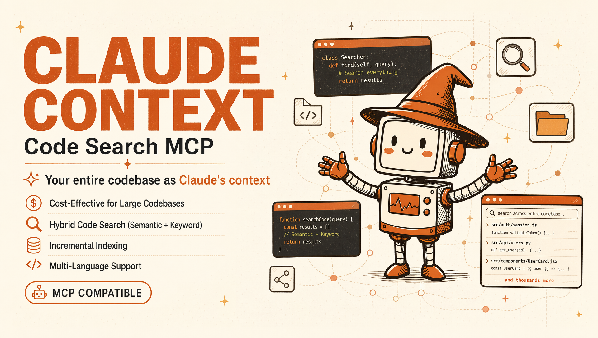
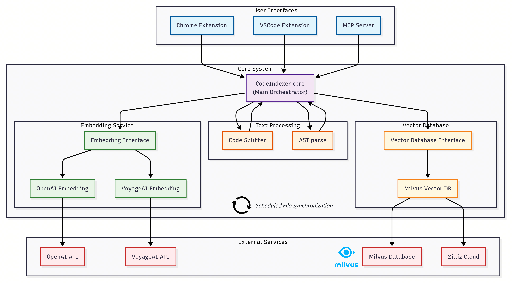
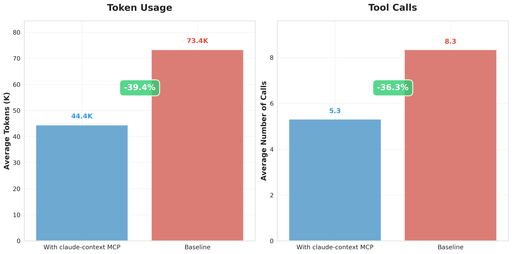

### Your entire codebase as Claude's context

[](https://opensource.org/licenses/MIT)
[](https://nodejs.org/)
[](docs/)
[](https://marketplace.visualstudio.com/items?itemName=zilliz.semanticcodesearch)
[](https://www.npmjs.com/package/@zilliz/claude-context-core)
[](https://www.npmjs.com/package/@zilliz/claude-context-mcp)
[](https://twitter.com/zilliz_universe)
[](https://deepwiki.com/zilliztech/claude-context)
<a href="https://discord.gg/mKc3R95yE5"></a>
</div>

**Claude Context** is an MCP plugin that adds semantic code search to Claude Code and other AI coding agents, giving them deep context from your entire codebase.

🧠 **Your Entire Codebase as Context**: Claude Context uses semantic search to find all relevant code from millions of lines. No multi-round discovery needed. It brings results straight into the Claude's context.

💰 **Cost-Effective for Large Codebases**: Instead of loading entire directories into Claude for every request, which can be very expensive, Claude Context efficiently stores your codebase in a vector database and only uses related code in context to keep your costs manageable.

---

## 🚀 Demo


Model Context Protocol (MCP) allows you to integrate Claude Context with your favorite AI coding assistants, e.g. Claude Code.

## Quick Start
### Prerequisites

<details>
<summary>Get a free vector database on Zilliz Cloud 👈</summary>

Claude Context needs a vector database. You can [sign up](https://cloud.zilliz.com/signup?utm_source=github&utm_medium=referral&utm_campaign=2507-codecontext-readme) on Zilliz Cloud to get an API key.


Copy your Personal Key to replace `your-zilliz-cloud-api-key` in the configuration examples.
</details>

<details>
<summary>Get OpenAI API Key for embedding model</summary>

You need an OpenAI API key for the embedding model. You can get one by signing up at [OpenAI](https://platform.openai.com/api-keys).  

Your API key will look like this: it always starts with `sk-`.  
Copy your key and use it in the configuration examples below as `your-openai-api-key`.

</details>

### Configure MCP for Claude Code

**System Requirements:**
- Node.js >= 20.0.0 and < 24.0.0
> Claude Context is not compatible with Node.js 24.0.0, you need downgrade it first if your node version is greater or equal to 24.

#### Configuration

Use the command line interface to add the Claude Context MCP server:

```bash
claude mcp add claude-context \
  -e OPENAI_API_KEY=sk-your-openai-api-key \
  -e MILVUS_TOKEN=your-zilliz-cloud-api-key \
  -- npx @zilliz/claude-context-mcp@latest
```


See the [Claude Code MCP documentation](https://docs.anthropic.com/en/docs/claude-code/mcp) for more details about MCP server management.


### Other MCP Client Configurations

<details>
<summary><strong>Gemini CLI</strong></summary>

Gemini CLI requires manual configuration through a JSON file:

1. Create or edit the `~/.gemini/settings.json` file.
2. Add the following configuration:

```json
{
  "mcpServers": {
    "claude-context": {
      "command": "npx",
      "args": ["@zilliz/claude-context-mcp@latest"],
      "env": {
        "OPENAI_API_KEY": "your-openai-api-key",
        "MILVUS_TOKEN": "your-zilliz-cloud-api-key"
      }
    }
  }
}
```
3. Save the file and restart Gemini CLI to apply the changes.

</details>

<details>
<summary><strong>Qwen Code</strong></summary>

Create or edit the `~/.qwen/settings.json` file and add the following configuration:

```json
{
  "mcpServers": {
    "claude-context": {
      "command": "npx",
      "args": ["@zilliz/claude-context-mcp@latest"],
      "env": {
        "OPENAI_API_KEY": "your-openai-api-key",
        "MILVUS_ADDRESS": "your-zilliz-cloud-public-endpoint",
        "MILVUS_TOKEN": "your-zilliz-cloud-api-key"
      }
    }
  }
}
```

</details>


<details>
<summary><strong>Cursor</strong></summary>

<a href="https://cursor.com/install-mcp?name=claude-context&config=JTdCJTIyY29tbWFuZCUyMiUzQSUyMm5weCUyMC15JTIwJTQwemlsbGl6JTJGY29kZS1jb250ZXh0LW1jcCU0MGxhdGVzdCUyMiUyQyUyMmVudiUyMiUzQSU3QiUyMk9QRU5BSV9BUElfS0VZJTIyJTNBJTIyeW91ci1vcGVuYWktYXBpLWtleSUyMiUyQyUyMk1JTFZVU19BRERSRVNTJTIyJTNBJTIybG9jYWxob3N0JTNBMTk1MzAlMjIlN0QlN0Q%3D"></a>

Go to: `Settings` -> `Cursor Settings` -> `MCP` -> `Add new global MCP server`

Pasting the following configuration into your Cursor `~/.cursor/mcp.json` file is the recommended approach. You may also install in a specific project by creating `.cursor/mcp.json` in your project folder. See [Cursor MCP docs](https://docs.cursor.com/context/model-context-protocol) for more info.

```json
{
  "mcpServers": {
    "claude-context": {
      "command": "npx",
      "args": ["-y", "@zilliz/claude-context-mcp@latest"],
      "env": {
        "OPENAI_API_KEY": "your-openai-api-key",
        "MILVUS_ADDRESS": "your-zilliz-cloud-public-endpoint",
        "MILVUS_TOKEN": "your-zilliz-cloud-api-key"
      }
    }
  }
}
```

</details>

<details>
<summary><strong>Void</strong></summary>

Go to: `Settings` -> `MCP` -> `Add MCP Server`

Add the following configuration to your Void MCP settings:

```json
{
  "mcpServers": {
    "code-context": {
      "command": "npx",
      "args": ["-y", "@zilliz/claude-context-mcp@latest"],
      "env": {
        "OPENAI_API_KEY": "your-openai-api-key",
        "MILVUS_ADDRESS": "your-zilliz-cloud-public-endpoint",
        "MILVUS_TOKEN": "your-zilliz-cloud-api-key"
      }
    }
  }
}
```

</details>

<details>
<summary><strong>Claude Desktop</strong></summary>

Add to your Claude Desktop configuration:

```json
{
  "mcpServers": {
    "claude-context": {
      "command": "npx",
      "args": ["@zilliz/claude-context-mcp@latest"],
      "env": {
        "OPENAI_API_KEY": "your-openai-api-key",
        "MILVUS_ADDRESS": "your-zilliz-cloud-public-endpoint",
        "MILVUS_TOKEN": "your-zilliz-cloud-api-key"
      }
    }
  }
}
```

</details>

<details>
<summary><strong>Windsurf</strong></summary>

Windsurf supports MCP configuration through a JSON file. Add the following configuration to your Windsurf MCP settings:

```json
{
  "mcpServers": {
    "claude-context": {
      "command": "npx",
      "args": ["-y", "@zilliz/claude-context-mcp@latest"],
      "env": {
        "OPENAI_API_KEY": "your-openai-api-key",
        "MILVUS_ADDRESS": "your-zilliz-cloud-public-endpoint",
        "MILVUS_TOKEN": "your-zilliz-cloud-api-key"
      }
    }
  }
}
```

</details>

<details>
<summary><strong>VS Code</strong></summary>

The Claude Context MCP server can be used with VS Code through MCP-compatible extensions. Add the following configuration to your VS Code MCP settings:

```json
{
  "mcpServers": {
    "claude-context": {
      "command": "npx",
      "args": ["-y", "@zilliz/claude-context-mcp@latest"],
      "env": {
        "OPENAI_API_KEY": "your-openai-api-key",
        "MILVUS_ADDRESS": "your-zilliz-cloud-public-endpoint",
        "MILVUS_TOKEN": "your-zilliz-cloud-api-key"
      }
    }
  }
}
```

</details>

<details>
<summary><strong>Cherry Studio</strong></summary>

Cherry Studio allows for visual MCP server configuration through its settings interface. While it doesn't directly support manual JSON configuration, you can add a new server via the GUI:

1. Navigate to **Settings → MCP Servers → Add Server**.
2. Fill in the server details:
   - **Name**: `claude-context`
   - **Type**: `STDIO`
   - **Command**: `npx`
   - **Arguments**: `["@zilliz/claude-context-mcp@latest"]`
   - **Environment Variables**:
     - `OPENAI_API_KEY`: `your-openai-api-key`
     - `MILVUS_ADDRESS`: `your-zilliz-cloud-public-endpoint`
     - `MILVUS_TOKEN`: `your-zilliz-cloud-api-key`
3. Save the configuration to activate the server.

</details>

<details>
<summary><strong>Cline</strong></summary>

Cline uses a JSON configuration file to manage MCP servers. To integrate the provided MCP server configuration:

1. Open Cline and click on the **MCP Servers** icon in the top navigation bar.

2. Select the **Installed** tab, then click **Advanced MCP Settings**.

3. In the `cline_mcp_settings.json` file, add the following configuration:

```json
{
  "mcpServers": {
    "claude-context": {
      "command": "npx",
      "args": ["@zilliz/claude-context-mcp@latest"],
      "env": {
        "OPENAI_API_KEY": "your-openai-api-key",
        "MILVUS_ADDRESS": "your-zilliz-cloud-public-endpoint",
        "MILVUS_TOKEN": "your-zilliz-cloud-api-key"
      }
    }
  }
}
```

4. Save the file.

</details>

<details>
<summary><strong>Augment</strong></summary>

To configure Claude Context MCP in Augment Code, you can use either the graphical interface or manual configuration.

#### **A. Using the Augment Code UI**

1. Click the hamburger menu.

2. Select **Settings**.

3. Navigate to the **Tools** section.

4. Click the **+ Add MCP** button.

5. Enter the following command:

   ```
   npx @zilliz/claude-context-mcp@latest
   ```

6. Name the MCP: **Claude Context**.

7. Click the **Add** button.

------

#### **B. Manual Configuration**

1. Press Cmd/Ctrl Shift P or go to the hamburger menu in the Augment panel
2. Select Edit Settings
3. Under Advanced, click Edit in settings.json
4. Add the server configuration to the `mcpServers` array in the `augment.advanced` object

```json
"augment.advanced": { 
  "mcpServers": [ 
    { 
      "name": "claude-context", 
      "command": "npx", 
      "args": ["-y", "@zilliz/claude-context-mcp@latest"],
      "env": {
        "OPENAI_API_KEY": "your-openai-api-key",
        "MILVUS_ADDRESS": "your-zilliz-cloud-public-endpoint",
        "MILVUS_TOKEN": "your-zilliz-cloud-api-key"
      }
    }
  ]
}
```

</details>

<details>
<summary><strong>Roo Code</strong></summary>

Roo Code utilizes a JSON configuration file for MCP servers:

1. Open Roo Code and navigate to **Settings → MCP Servers → Edit Global Config**.

2. In the `mcp_settings.json` file, add the following configuration:

```json
{
  "mcpServers": {
    "claude-context": {
      "command": "npx",
      "args": ["@zilliz/claude-context-mcp@latest"],
      "env": {
        "OPENAI_API_KEY": "your-openai-api-key",
        "MILVUS_ADDRESS": "your-zilliz-cloud-public-endpoint",
        "MILVUS_TOKEN": "your-zilliz-cloud-api-key"
      }
    }
  }
}
```

3. Save the file to activate the server.

</details>

<details>
<summary><strong>Zencoder</strong></summary>

Zencoder offers support for MCP tools and servers in both its JetBrains and VS Code plugin versions.

1. Go to the Zencoder menu (...)
2. From the dropdown menu, select `Tools`
3. Click on the `Add Custom MCP`
4. Add the name (i.e. `Claude Context` and server configuration from below, and make sure to hit the `Install` button

```json
{
    "command": "npx",
    "args": ["@zilliz/claude-context-mcp@latest"],
    "env": {
      "OPENAI_API_KEY": "your-openai-api-key",
      "MILVUS_ADDRESS": "your-zilliz-cloud-public-endpoint",
      "MILVUS_TOKEN": "your-zilliz-cloud-api-key"
    }
}

```

5. Save the server by hitting the `Install` button.

</details>


<details>
<summary><strong>Other MCP Clients</strong></summary>

The server uses stdio transport and follows the standard MCP protocol. It can be integrated with any MCP-compatible client by running:

```bash
npx @zilliz/claude-context-mcp@latest
```

</details>

---
### Usage in Your Codebase

1. **Open Claude Code**
   ```
   cd your-project-directory
   claude
   ```
2. **Index your codebase**:
   ```
   Index this codebase
   ```
3. **Check indexing status**:
   ```
   Check the indexing status
   ```
4. **Start searching**:
   ```
   Find functions that handle user authentication
   ```

🎉 **That's it!** You now have semantic code search in Claude Code.

---

### Environment Variables Configuration

For more detailed MCP environment variable configuration, see our [Environment Variables Guide](docs/getting-started/environment-variables.md).

### Using Different Embedding Models

To configure custom embedding models (e.g., `text-embedding-3-large` for OpenAI, `voyage-code-3` for VoyageAI), see the [MCP Configuration Examples](packages/mcp/README.md#embedding-provider-configuration) for detailed setup instructions for each provider.

### File Inclusion & Exclusion Rules

For detailed explanation of file inclusion and exclusion rules, and how to customize them, see our [File Inclusion & Exclusion Rules](docs/dive-deep/file-inclusion-rules.md).

### Available Tools

#### 1. `index_codebase`
Index a codebase directory for hybrid search (BM25 + dense vector).

#### 2. `search_code`
Search the indexed codebase using natural language queries with hybrid search (BM25 + dense vector).

#### 3. `clear_index`
Clear the search index for a specific codebase.

#### 4. `get_indexing_status`
Get the current indexing status of a codebase. Shows progress percentage for actively indexing codebases and completion status for indexed codebases.

---

## 🏗️ Architecture



### 🔧 Implementation Details

- 🔍 **Hybrid Code Search**: Ask questions like *"find functions that handle user authentication"* and get relevant, context-rich code instantly using advanced hybrid search (BM25 + dense vector).
- 🧠 **Context-Aware**: Discover large codebase, understand how different parts of your codebase relate, even across millions of lines of code.
- ⚡ **Incremental Indexing**: Efficiently re-index only changed files using Merkle trees.
- 🧩 **Intelligent Code Chunking**: Analyze code in Abstract Syntax Trees (AST) for chunking.
- 🗄️ **Scalable**: Integrates with Zilliz Cloud for scalable vector search, no matter how large your codebase is.
- 🛠️ **Customizable**: Configure file extensions, ignore patterns, and embedding models.

### Core Components
Claude Context is a monorepo containing three main packages:

- **`@zilliz/claude-context-core`**: Core indexing engine with embedding and vector database integration
- **VSCode Extension**: Semantic Code Search extension for Visual Studio Code
- **`@zilliz/claude-context-mcp`**: Model Context Protocol server for AI agent integration

### Supported Technologies
- **Embedding Providers**: [OpenAI](https://openai.com), [VoyageAI](https://voyageai.com), [Ollama](https://ollama.ai), [Gemini](https://gemini.google.com)
- **Vector Databases**: [Milvus](https://milvus.io) or [Zilliz Cloud](https://zilliz.com/cloud)(fully managed vector database as a service)
- **Code Splitters**: AST-based splitter (with automatic fallback), LangChain character-based splitter
- **Languages**: TypeScript, JavaScript, Python, Java, C++, C#, Go, Rust, PHP, Ruby, Swift, Kotlin, Scala, Markdown
- **Development Tools**: VSCode, Model Context Protocol

---

## 📦 Other Ways to Use Claude Context

While MCP is the recommended way to use Claude Context with AI assistants, you can also use it directly or through the VSCode extension.

### Build Applications with Core Package

The `@zilliz/claude-context-core` package provides the fundamental functionality for code indexing and semantic search.

```typescript
import { Context, MilvusVectorDatabase, OpenAIEmbedding } from '@zilliz/claude-context-core';

// Initialize embedding provider
const embedding = new OpenAIEmbedding({
    apiKey: process.env.OPENAI_API_KEY || 'your-openai-api-key',
    model: 'text-embedding-3-small'
});

// Initialize vector database
const vectorDatabase = new MilvusVectorDatabase({
    address: process.env.MILVUS_ADDRESS || 'your-zilliz-cloud-public-endpoint',
    token: process.env.MILVUS_TOKEN || 'your-zilliz-cloud-api-key'
});

// Create context instance
const context = new Context({
    embedding,
    vectorDatabase
});

// Index your codebase with progress tracking
const stats = await context.indexCodebase('./your-project', (progress) => {
    console.log(`${progress.phase} - ${progress.percentage}%`);
});
console.log(`Indexed ${stats.indexedFiles} files, ${stats.totalChunks} chunks`);

// Perform semantic search
const results = await context.semanticSearch('./your-project', 'vector database operations', 5);
results.forEach(result => {
    console.log(`File: ${result.relativePath}:${result.startLine}-${result.endLine}`);
    console.log(`Score: ${(result.score * 100).toFixed(2)}%`);
    console.log(`Content: ${result.content.substring(0, 100)}...`);
});
```

### VSCode Extension

Integrates Claude Context directly into your IDE. Provides an intuitive interface for semantic code search and navigation.

1. **Direct Link**: [Install from VS Code Marketplace](https://marketplace.visualstudio.com/items?itemName=zilliz.semanticcodesearch)
2. **Manual Search**:
    - Open Extensions view in VSCode (Ctrl+Shift+X or Cmd+Shift+X on Mac)
    - Search for "Semantic Code Search"
    - Click Install


---

## 🛠️ Development

### Setup Development Environment

```bash
# Clone repository
git clone https://github.com/zilliztech/claude-context.git
cd claude-context

# Install dependencies
pnpm install

# Build all packages
pnpm build

# Start development mode
pnpm dev
```

### Building

```bash
# Build all packages
pnpm build

# Build specific package
pnpm build:core
pnpm build:vscode
pnpm build:mcp
```

### Running Examples

```bash
# Development with file watching
cd examples/basic-usage
pnpm dev
```

---

## 📖 Examples

Check the `/examples` directory for complete usage examples:

- **Basic Usage**: Simple indexing and search example

---

## 📊 Evaluation

Our controlled evaluation demonstrates that Claude Context MCP achieves ~40% token reduction under the condition of equivalent retrieval quality. This translates to significant cost and time savings in production environments. This also means that, under the constraint of limited token context length, using Claude Context yields better retrieval and answer results.



For detailed evaluation methodology and results, see the [evaluation directory](evaluation/).

---

## ❓ FAQ

**Common Questions:**

- **[What files does Claude Context decide to embed?](docs/troubleshooting/faq.md#q-what-files-does-claude-context-decide-to-embed)**
- **[Can I use a fully local deployment setup?](docs/troubleshooting/faq.md#q-can-i-use-a-fully-local-deployment-setup)**
- **[Does it support multiple projects / codebases?](docs/troubleshooting/faq.md#q-does-it-support-multiple-projects--codebases)**

For detailed answers and more troubleshooting tips, see our [FAQ Guide](docs/troubleshooting/faq.md).

📚 **Need more help?** Check out our [complete documentation](docs/) for detailed guides and troubleshooting tips.

---

## 🤝 Contributing

We welcome contributions! Please see our [Contributing Guide](CONTRIBUTING.md) for details on how to get started.

**Package-specific contributing guides:**
- [Core Package Contributing](packages/core/CONTRIBUTING.md)
- [MCP Server Contributing](packages/mcp/CONTRIBUTING.md)  
- [VSCode Extension Contributing](packages/vscode-extension/CONTRIBUTING.md)

---

## 🗺️ Roadmap

- [x] AST-based code analysis for improved understanding
- [x] Support for additional embedding providers
- [ ] Agent-based interactive search mode
- [x] Enhanced code chunking strategies
- [ ] Search result ranking optimization
- [ ] Robust Chrome Extension

---

## 📄 License

This project is licensed under the MIT License - see the [LICENSE](LICENSE) file for details.

---

## 🔗 Links

- [GitHub Repository](https://github.com/zilliztech/claude-context)
- [VSCode Marketplace](https://marketplace.visualstudio.com/items?itemName=zilliz.semanticcodesearch)
- [Milvus Documentation](https://milvus.io/docs)
- [Zilliz Cloud](https://zilliz.com/cloud)
