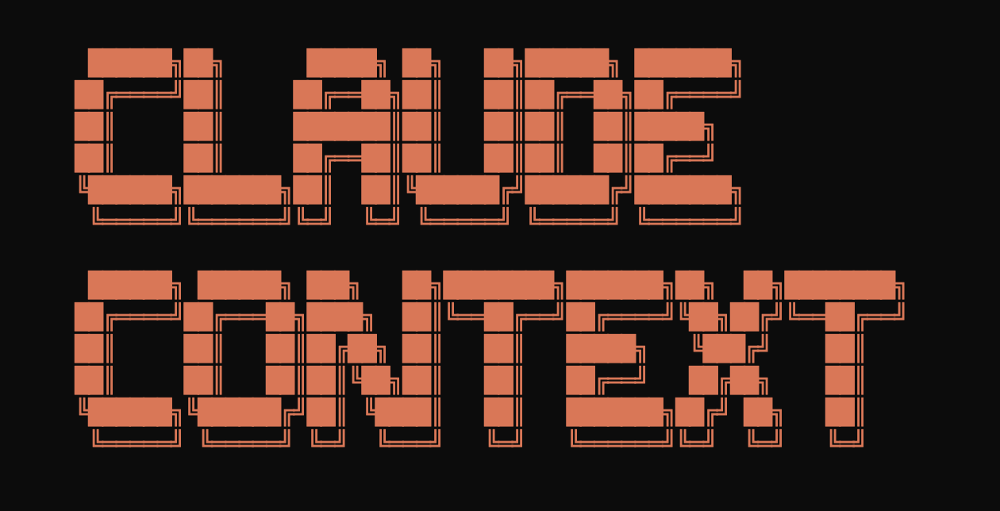

# Claude Context Documentation

Welcome to the Claude Context documentation! Claude Context is a powerful tool that adds semantic code search capabilities to AI coding assistants through MCP.

## 🚀 Quick Navigation

### Getting Started
- [📋 Project Overview](getting-started/overview.md) - What is Claude Context and how it works
- [🛠️ Prerequisites](getting-started/prerequisites.md) - What you need before starting
- [⚡ Quick Start Guide](getting-started/quick-start.md) - Get up and running in 1 minutes

### Components
- [MCP Server](../packages/mcp/README.md) - The MCP server of Claude Context
- [VSCode Extension](../packages/vscode-extension/README.md) - The VSCode extension of Claude Context
- [Core Package](../packages/core/README.md) - The core package of Claude Context

### Troubleshooting
- [❓ FAQ](troubleshooting/faq.md) - Frequently asked questions

## 🔗 External Resources

- [GitHub Repository](https://github.com/zilliztech/claude-context)
- [VSCode Marketplace](https://marketplace.visualstudio.com/items?itemName=zilliz.semanticcodesearch)
- [npm - Core Package](https://www.npmjs.com/package/@zilliz/claude-context-core)
- [npm - MCP Server](https://www.npmjs.com/package/@zilliz/claude-context-mcp)
- [Zilliz Cloud](https://cloud.zilliz.com)

## 💬 Support

- **Issues**: [GitHub Issues](https://github.com/zilliztech/claude-context/issues)
- **Discord**: [Join our Discord](https://discord.gg/mKc3R95yE5)
