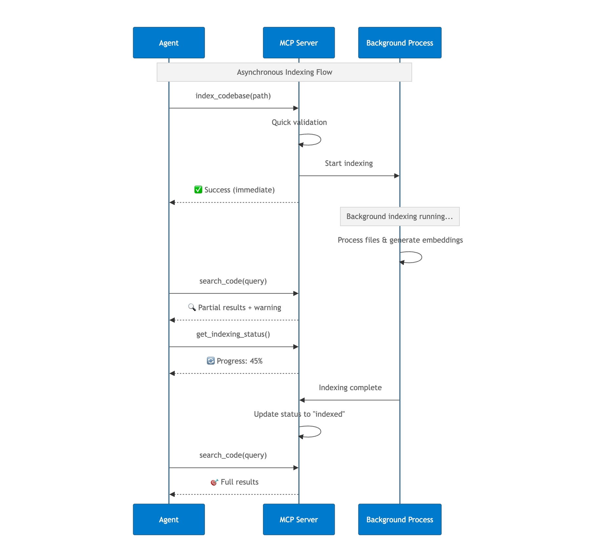
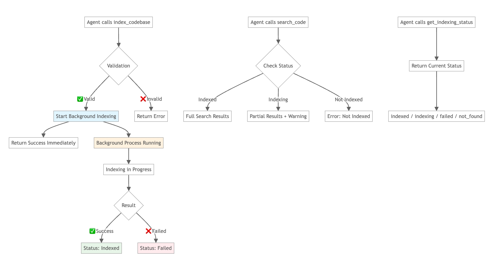

# Asynchronous Indexing Workflow

This document explains how Claude Context MCP handles codebase indexing asynchronously in the background.

## Core Concept

Claude Context MCP server allows users to start indexing and get an immediate response, while the actual indexing happens in the background. Users can search and monitor progress at any time.

## How It Works

The sequence diagram above demonstrates the timing and interaction between the agent, MCP server, and background process. 

The agent receives an immediate response when starting indexing, then the users can perform searches and status checks through the agent while indexing continues in the background.

## State Flow

The flow diagram above shows the complete indexing workflow, illustrating how the system handles different states and user interactions. The key insight is that indexing starts immediately but runs in the background, allowing users to interact with the system at any time.

## MCP Tools

- **`index_codebase`** - Starts background indexing, returns immediately
- **`search_code`** - Searches codebase (works during indexing with partial results)
- **`get_indexing_status`** - Shows current progress and status
- **`clear_index`** - Removes indexed data

## Status States

- **`indexed`** - ✅ Ready for search
- **`indexing`** - 🔄 Background process running
- **`indexfailed`** - ❌ Error occurred, can retry
- **`not_found`** - ❌ Not indexed yet

## Key Benefits

- **Non-blocking**: Agent gets immediate response
- **Progressive**: Can search partial results while indexing
- **Resilient**: Handles errors gracefully with retry capability
- **Transparent**: Always know current status
