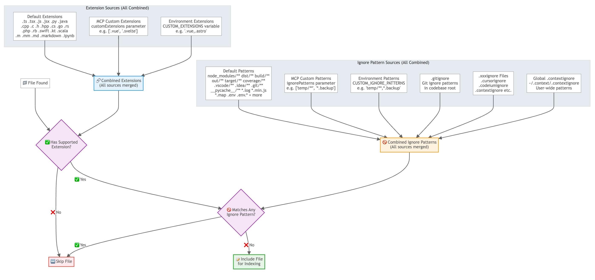

# File Inclusion & Exclusion Rules

This document explains how Claude Context determines which files to include in the indexing process and which files to exclude.

## Overview

Claude Context uses a comprehensive rule system that combines multiple sources of file extensions and ignore patterns to determine what gets indexed.

## The Core Rule

```
Final Files = (All Supported Extensions) - (All Ignore Patterns)
```

Where:
- **All Supported Extensions** = Default + MCP Custom + Environment Variable Extensions
- **All Ignore Patterns** = Default + MCP Custom + Environment Variable + .gitignore + .xxxignore + Global .contextignore

## File Inclusion Flow



The diagram above shows how different sources contribute to the final file selection process.

## Extension Sources (Additive)

All extension sources are combined together:

### 1. Default Extensions
Built-in supported file extensions including:
- Programming languages: `.ts`, `.tsx`, `.js`, `.jsx`, `.py`, `.java`, `.cpp`, `.c`, `.h`, `.hpp`, `.cs`, `.go`, `.rs`, `.php`, `.rb`, `.swift`, `.kt`, `.scala`, `.m`, `.mm`
- Documentation: `.md`, `.markdown`, `.ipynb`

For more details, see [DEFAULT_SUPPORTED_EXTENSIONS](../../packages/core/src/context.ts) in the context.ts file.


### 2. MCP Custom Extensions
Additional extensions passed dynamically via MCP `customExtensions` parameter:
```json
{
  "customExtensions": [".vue", ".svelte", ".astro"]
}
```
Just dynamically tell the agent what extensions you want to index to invoke this parameter. For example:
```
"Index this codebase, and include .vue, .svelte, .astro files"
```

### 3. Environment Variable Extensions
Extensions from `CUSTOM_EXTENSIONS` environment variable:
```bash
export CUSTOM_EXTENSIONS=".vue,.svelte,.astro"
```
See [Environment Variables](../getting-started/environment-variables.md) for more details about how to set environment variables.

## Ignore Pattern Sources (Additive)

All ignore pattern sources are combined together:

### 1. Default Ignore Patterns
Built-in patterns for common files/directories to exclude:
- **Build outputs**: `node_modules/**`, `dist/**`, `build/**`, `out/**`, `target/**`, `coverage/**`, `.nyc_output/**`
- **IDE files**: `.vscode/**`, `.idea/**`, `*.swp`, `*.swo`
- **Version control**: `.git/**`, `.svn/**`, `.hg/**`
- **Cache directories**: `.cache/**`, `__pycache__/**`, `.pytest_cache/**`
- **Logs and temporary**: `logs/**`, `tmp/**`, `temp/**`, `*.log`
- **Environment files**: `.env`, `.env.*`, `*.local`
- **Minified files**: `*.min.js`, `*.min.css`, `*.min.map`, `*.bundle.js`, `*.bundle.css`, `*.chunk.js`, `*.vendor.js`, `*.polyfills.js`, `*.runtime.js`, `*.map`

For more details, see [DEFAULT_IGNORE_PATTERNS](../../packages/core/src/context.ts) in the context.ts file.

### 2. MCP Custom Ignore Patterns
Additional patterns passed dynamically via MCP `ignorePatterns` parameter:
```json
{
  "ignorePatterns": ["temp/**", "*.backup", "private/**"]
}
```
Just dynamically tell the agent what patterns you want to exclude to invoke this parameter. For example:
```
"Index this codebase, and exclude temp/**, *.backup, private/** files"
```

### 3. Environment Variable Ignore Patterns
Patterns from `CUSTOM_IGNORE_PATTERNS` environment variable:
```bash
export CUSTOM_IGNORE_PATTERNS="temp/**,*.backup,private/**"
```
See [Environment Variables](../getting-started/environment-variables.md) for more details about how to set environment variables.

### 4. .gitignore Files
Standard Git ignore patterns in codebase root.

### 5. .xxxignore Files
Any file in codebase root matching pattern `.xxxignore`:
- `.cursorignore`
- `.codeiumignore` 
- `.contextignore`
- etc.

### 6. Global .contextignore
User-wide patterns in `~/.context/.contextignore`.
