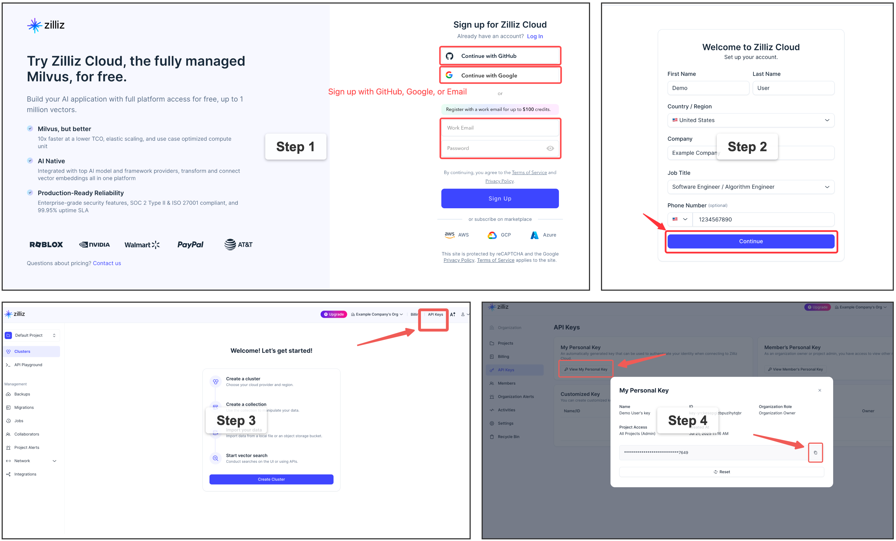

# Quick Start Guide

Get Claude Context running with AI assistants in under 5 minutes! This guide covers the most common setup using MCP (Model Context Protocol) with Claude Code.

## 🚀 1-Minute Setup for Claude Code

### Step 1: Get API Keys

You'll need two API keys:

1. **OpenAI API Key**: Get from [OpenAI Platform](https://platform.openai.com/api-keys)
2. **Zilliz Cloud API Key**: 
 [Sign up](https://cloud.zilliz.com/signup?utm_source=github&utm_medium=referral&utm_campaign=2507-codecontext-readme) on Zilliz Cloud to get an API key.

### Step 2: Configure Claude Code

Run this single command to add Claude Context to Claude Code:

```bash
claude mcp add claude-context \
  -e OPENAI_API_KEY=sk-your-openai-api-key \
  -e MILVUS_TOKEN=your-zilliz-cloud-api-key \
  -- npx @zilliz/claude-context-mcp@latest
```

Replace the API keys with your actual keys.

### Step 3: Start Using Claude Context

1. **Open Claude Code** in your project directory
2. **Index your codebase**:
   ```
   Index this codebase
   ```
3. **Start searching**:
   ```
   Find functions that handle user authentication
   ```

🎉 **That's it!** You now have semantic code search in Claude Code.

## Alternative Quick Setups

<details>
<summary><strong>Qwen Code</strong></summary>

Create or edit the `~/.qwen/settings.json` file and add the following configuration:

```json
{
  "mcpServers": {
    "claude-context": {
      "command": "npx",
      "args": ["@zilliz/claude-context-mcp@latest"],
      "env": {
        "OPENAI_API_KEY": "your-openai-api-key",
        "MILVUS_TOKEN": "your-zilliz-cloud-api-key"
      }
    }
  }
}
```

</details>

<details>
<summary><strong>Cursor</strong></summary>

Go to: `Settings` -> `Cursor Settings` -> `MCP` -> `Add new global MCP server`

Pasting the following configuration into your Cursor `~/.cursor/mcp.json` file is the recommended approach. You may also install in a specific project by creating `.cursor/mcp.json` in your project folder. See [Cursor MCP docs](https://docs.cursor.com/context/model-context-protocol) for more info.

**OpenAI Configuration (Default):**
```json
{
  "mcpServers": {
    "claude-context": {
      "command": "npx",
      "args": ["-y", "@zilliz/claude-context-mcp@latest"],
      "env": {
        "EMBEDDING_PROVIDER": "OpenAI",
        "OPENAI_API_KEY": "your-openai-api-key",
        "MILVUS_TOKEN": "your-zilliz-cloud-api-key"
      }
    }
  }
}
```

**VoyageAI Configuration:**
```json
{
  "mcpServers": {
    "claude-context": {
      "command": "npx",
      "args": ["-y", "@zilliz/claude-context-mcp@latest"],
      "env": {
        "EMBEDDING_PROVIDER": "VoyageAI",
        "VOYAGEAI_API_KEY": "your-voyageai-api-key",
        "EMBEDDING_MODEL": "voyage-code-3",
        "MILVUS_TOKEN": "your-zilliz-cloud-api-key"
      }
    }
  }
}
```

**Gemini Configuration:**
```json
{
  "mcpServers": {
    "claude-context": {
      "command": "npx",
      "args": ["-y", "@zilliz/claude-context-mcp@latest"],
      "env": {
        "EMBEDDING_PROVIDER": "Gemini",
        "GEMINI_API_KEY": "your-gemini-api-key",
        "MILVUS_TOKEN": "your-zilliz-cloud-api-key"
      }
    }
  }
}
```

**Ollama Configuration:**
```json
{
  "mcpServers": {
    "claude-context": {
      "command": "npx",
      "args": ["-y", "@zilliz/claude-context-mcp@latest"],
      "env": {
        "EMBEDDING_PROVIDER": "Ollama",
        "EMBEDDING_MODEL": "nomic-embed-text",
        "OLLAMA_HOST": "http://127.0.0.1:11434",
        "MILVUS_TOKEN": "your-zilliz-cloud-api-key"
      }
    }
  }
}
```

</details>


<details>
<summary><strong>Void</strong></summary>

Go to: `Settings` -> `MCP` -> `Add MCP Server`

Add the following configuration to your Void MCP settings:

```json
{
  "mcpServers": {
    "code-context": {
      "command": "npx",
      "args": ["-y", "@zilliz/claude-context-mcp@latest"],
      "env": {
        "OPENAI_API_KEY": "your-openai-api-key",
        "MILVUS_ADDRESS": "your-zilliz-cloud-public-endpoint",
        "MILVUS_TOKEN": "your-zilliz-cloud-api-key"
      }
    }
  }
}
```

</details>


<details>
<summary><strong>Claude Desktop</strong></summary>

Add to your Claude Desktop configuration:

```json
{
  "mcpServers": {
    "claude-context": {
      "command": "npx",
      "args": ["@zilliz/claude-context-mcp@latest"],
      "env": {
        "OPENAI_API_KEY": "your-openai-api-key",
        "MILVUS_TOKEN": "your-zilliz-cloud-api-key"
      }
    }
  }
}
```

</details>

<details>
<summary><strong>Claude Code</strong></summary>

Use the command line interface to add the Claude Context MCP server:

```bash
# Add the Claude Context MCP server
claude mcp add claude-context -e OPENAI_API_KEY=your-openai-api-key -e MILVUS_TOKEN=your-zilliz-cloud-api-key -- npx @zilliz/claude-context-mcp@latest

```

See the [Claude Code MCP documentation](https://docs.anthropic.com/en/docs/claude-code/mcp) for more details about MCP server management.

</details>


<details>
<summary><strong>Windsurf</strong></summary>

Windsurf supports MCP configuration through a JSON file. Add the following configuration to your Windsurf MCP settings:

```json
{
  "mcpServers": {
    "claude-context": {
      "command": "npx",
      "args": ["-y", "@zilliz/claude-context-mcp@latest"],
      "env": {
        "OPENAI_API_KEY": "your-openai-api-key",
        "MILVUS_TOKEN": "your-zilliz-cloud-api-key"
      }
    }
  }
}
```

</details>

<details>
<summary><strong>VS Code</strong></summary>

The Claude Context MCP server can be used with VS Code through MCP-compatible extensions. Add the following configuration to your VS Code MCP settings:

```json
{
  "mcpServers": {
    "claude-context": {
      "command": "npx",
      "args": ["-y", "@zilliz/claude-context-mcp@latest"],
      "env": {
        "OPENAI_API_KEY": "your-openai-api-key",
        "MILVUS_TOKEN": "your-zilliz-cloud-api-key"
      }
    }
  }
}
```

</details>

<details>
<summary><strong>Cherry Studio</strong></summary>

Cherry Studio allows for visual MCP server configuration through its settings interface. While it doesn't directly support manual JSON configuration, you can add a new server via the GUI:

1. Navigate to **Settings → MCP Servers → Add Server**.
2. Fill in the server details:
   - **Name**: `claude-context`
   - **Type**: `STDIO`
   - **Command**: `npx`
   - **Arguments**: `["@zilliz/claude-context-mcp@latest"]`
   - **Environment Variables**:
     - `OPENAI_API_KEY`: `your-openai-api-key`
     - `MILVUS_TOKEN`: `your-zilliz-cloud-api-key`
3. Save the configuration to activate the server.

</details>

<details>
<summary><strong>Cline</strong></summary>

Cline uses a JSON configuration file to manage MCP servers. To integrate the provided MCP server configuration:

1. Open Cline and click on the **MCP Servers** icon in the top navigation bar.

2. Select the **Installed** tab, then click **Advanced MCP Settings**.

3. In the `cline_mcp_settings.json` file, add the following configuration:

```json
{
  "mcpServers": {
    "claude-context": {
      "command": "npx",
      "args": ["@zilliz/claude-context-mcp@latest"],
      "env": {
        "OPENAI_API_KEY": "your-openai-api-key",
        "MILVUS_TOKEN": "your-zilliz-cloud-api-key"
      }
    }
  }
}
```

4. Save the file.

</details>


<details>
<summary><strong>Augment</strong></summary>

To configure Claude Context MCP in Augment Code, you can use either the graphical interface or manual configuration.

#### **A. Using the Augment Code UI**

1. Click the hamburger menu.

2. Select **Settings**.

3. Navigate to the **Tools** section.

4. Click the **+ Add MCP** button.

5. Enter the following command:

   ```
   npx @zilliz/claude-context-mcp@latest
   ```

6. Name the MCP: **Claude Context**.

7. Click the **Add** button.

------

#### **B. Manual Configuration**

1. Press Cmd/Ctrl Shift P or go to the hamburger menu in the Augment panel
2. Select Edit Settings
3. Under Advanced, click Edit in settings.json
4. Add the server configuration to the `mcpServers` array in the `augment.advanced` object

```json
"augment.advanced": { 
  "mcpServers": [ 
    { 
      "name": "claude-context", 
      "command": "npx", 
      "args": ["-y", "@zilliz/claude-context-mcp@latest"],
      "env": {
        "OPENAI_API_KEY": "your-openai-api-key",
        "MILVUS_ADDRESS": "your-zilliz-cloud-public-endpoint",
        "MILVUS_TOKEN": "your-zilliz-cloud-api-key"
      }
    }
  ]
}
```

</details>

<details>
<summary><strong>Roo Code</strong></summary>

Roo Code utilizes a JSON configuration file for MCP servers:

1. Open Roo Code and navigate to **Settings → MCP Servers → Edit Global Config**.

2. In the `mcp_settings.json` file, add the following configuration:

```json
{
  "mcpServers": {
    "claude-context": {
      "command": "npx",
      "args": ["@zilliz/claude-context-mcp@latest"],
      "env": {
        "OPENAI_API_KEY": "your-openai-api-key",
        "MILVUS_ADDRESS": "your-zilliz-cloud-public-endpoint",
        "MILVUS_TOKEN": "your-zilliz-cloud-api-key"
      }
    }
  }
}
```

3. Save the file to activate the server.

</details>


<details>
<summary><strong>Other MCP Clients</strong></summary>

The server uses stdio transport and follows the standard MCP protocol. It can be integrated with any MCP-compatible client by running:

```bash
npx @zilliz/claude-context-mcp@latest
```

</details>

> 💡 **Tip**: For easier configuration management, you can use [global environment variables](environment-variables.md) instead of specifying them in each MCP client configuration.
