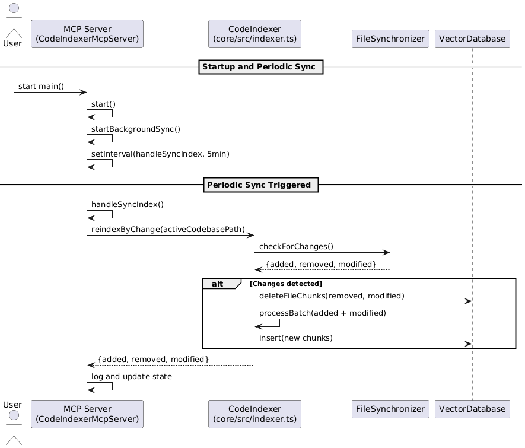

# @code-indexer/core

The core indexing engine for CodeIndexer - a powerful tool for semantic search and analysis of codebases using vector embeddings and AI.

[](https://www.npmjs.com/package/@code-indexer/core)
[](https://www.npmjs.com/package/@code-indexer/core)

> 📖 **New to CodeIndexer?** Check out the [main project README](../../README.md) for an overview and quick start guide.

## Features

- **Multi-language Support**: Index TypeScript, JavaScript, Python, Java, C++, and many other programming languages
- **Semantic Search**: Find code using natural language queries powered by AI embeddings
- **Flexible Architecture**: Pluggable embedding providers and vector databases
- **Smart Chunking**: Intelligent code splitting that preserves context and structure
- **Batch Processing**: Efficient processing of large codebases with progress tracking
- **Pattern Matching**: Built-in ignore patterns for common build artifacts and dependencies
- **Incremental File Synchronization**: Efficient change detection using Merkle trees to only re-index modified files

## File Synchronization Architecture

CodeIndexer implements an intelligent file synchronization system that efficiently tracks and processes only the files that have changed since the last indexing operation. This dramatically improves performance when working with large codebases.



### How It Works

The file synchronization system uses a **Merkle tree-based approach** combined with SHA-256 file hashing to detect changes:

#### 1. File Hashing
- Each file in the codebase is hashed using SHA-256
- File hashes are computed based on file content, not metadata
- Hashes are stored with relative file paths for consistency across different environments

#### 2. Merkle Tree Construction
- All file hashes are organized into a Merkle tree structure
- The tree provides a single root hash that represents the entire codebase state
- Any change to any file will cause the root hash to change

#### 3. Snapshot Management
- File synchronization state is persisted to `~/.codeindexer/merkle/` directory
- Each codebase gets a unique snapshot file based on its absolute path hash
- Snapshots contain both file hashes and serialized Merkle tree data

#### 4. Change Detection Process
1. **Quick Check**: Compare current Merkle root hash with stored snapshot
2. **Detailed Analysis**: If root hashes differ, perform file-by-file comparison
3. **Change Classification**: Categorize changes into three types:
   - **Added**: New files that didn't exist before
   - **Modified**: Existing files with changed content
   - **Removed**: Files that were deleted from the codebase

#### 5. Incremental Updates
- Only process files that have actually changed
- Update vector database entries only for modified chunks
- Remove entries for deleted files
- Add entries for new files

## Embedding Providers

- **OpenAI Embeddings** (`text-embedding-3-small`, `text-embedding-3-large`)
- **VoyageAI Embeddings** - High-quality embeddings optimized for code

## Vector Database Support

- **Milvus/Zilliz Cloud** - High-performance vector database

## Code Splitters

- **LangChain Code Splitter** - Language-aware code chunking

## Installation

```bash
npm install @code-indexer/core
```

## Quick Start

```typescript
import { 
  CodeIndexer, 
  OpenAIEmbedding, 
  MilvusVectorDB 
} from '@code-indexer/core';

// Initialize the indexer
const indexer = new CodeIndexer({
  embedding: new OpenAIEmbedding({
    apiKey: process.env.OPENAI_API_KEY,
    model: 'text-embedding-3-small'
  }),
  vectorDatabase: new MilvusVectorDB({
    address: 'localhost:19530'
  })
});

// Index a codebase
const stats = await indexer.indexCodebase('./my-project', (progress) => {
  console.log(`${progress.phase} - ${progress.percentage}%`);
});

console.log(`Indexed ${stats.indexedFiles} files with ${stats.totalChunks} chunks`);

// Search the codebase
const results = await indexer.semanticSearch(
  './my-project',
  'function that handles user authentication',
  5
);

results.forEach(result => {
  console.log(`${result.relativePath}:${result.startLine}-${result.endLine}`);
  console.log(`Score: ${result.score}`);
  console.log(result.content);
});
```

## Configuration

### CodeIndexerConfig

```typescript
interface CodeIndexerConfig {
  embedding?: Embedding;           // Embedding provider
  vectorDatabase?: VectorDatabase; // Vector database instance (required)
  codeSplitter?: Splitter;        // Code splitting strategy
  chunkSize?: number;             // Default: 1000
  chunkOverlap?: number;          // Default: 200
  supportedExtensions?: string[]; // File extensions to index
  ignorePatterns?: string[];      // Patterns to ignore
}
```

### Supported File Extensions (Default)

```typescript
[
  // Programming languages
  '.ts', '.tsx', '.js', '.jsx', '.py', '.java', '.cpp', '.c', '.h', '.hpp',
  '.cs', '.go', '.rs', '.php', '.rb', '.swift', '.kt', '.scala', '.m', '.mm',
  // Text and markup files  
  '.md', '.markdown'
]
```

### Default Ignore Patterns

- `node_modules/**`, `dist/**`, `build/**`, `out/**`
- `.git/**`, `.vscode/**`, `.idea/**`
- `*.min.js`, `*.bundle.js`, `*.map`
- Log files, cache directories, and temporary files

## API Reference

### CodeIndexer

#### Methods

- `indexCodebase(path, progressCallback?)` - Index an entire codebase
- `semanticSearch(path, query, topK?, threshold?)` - Search indexed code semantically
- `hasIndex(path)` - Check if codebase is already indexed
- `clearIndex(path, progressCallback?)` - Remove index for a codebase
- `updateIgnorePatterns(patterns)` - Update ignore patterns
- `updateEmbedding(embedding)` - Switch embedding provider
- `updateVectorDatabase(vectorDB)` - Switch vector database

### Search Results

```typescript
interface SemanticSearchResult {
  content: string;      // Code content
  relativePath: string; // File path relative to codebase root
  startLine: number;    // Starting line number
  endLine: number;      // Ending line number
  language: string;     // Programming language
  score: number;        // Similarity score
}
```

## Environment Variables

```bash
# OpenAI API Key (required for OpenAI embeddings)
OPENAI_API_KEY=your_openai_api_key

# VoyageAI API Key (required for VoyageAI embeddings)  
VOYAGEAI_API_KEY=your_voyageai_api_key
```

## Examples

### Using VoyageAI Embeddings

```typescript
import { VoyageAIEmbedding } from '@code-indexer/core';

const indexer = new CodeIndexer({
  embedding: new VoyageAIEmbedding({
    apiKey: process.env.VOYAGEAI_API_KEY,
    model: 'voyage-code-2'
  }),
  // ... other config
});
```

### Custom File Filtering

```typescript
const indexer = new CodeIndexer({
  supportedExtensions: ['.ts', '.js', '.py'],
  ignorePatterns: [
    'node_modules/**',
    'dist/**',
    '*.spec.ts'
  ],
  // ... other config
});
```

## Contributing

This package is part of the CodeIndexer monorepo. Please see:
- [Main Contributing Guide](../../CONTRIBUTING.md) - General contribution guidelines
- [Core Package Contributing](CONTRIBUTING.md) - Specific development guide for this package

## Related Packages

- **[@code-indexer/mcp](../mcp)** - MCP server that uses this core engine
- **[VSCode Extension](../vscode-extension)** - VSCode extension built on this core

## License

MIT - See [LICENSE](../../LICENSE) for details